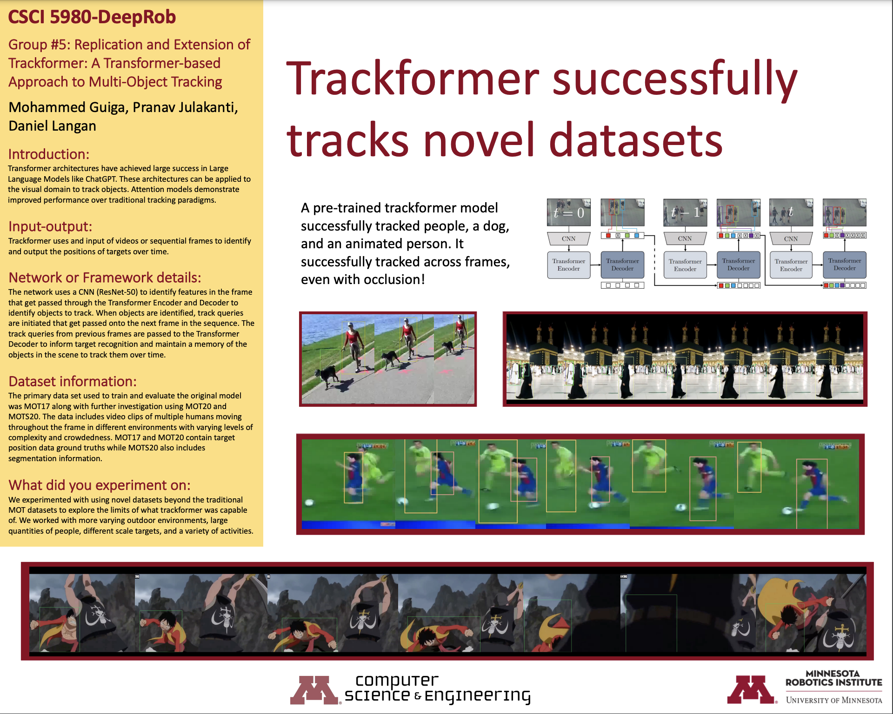

# DeepRob-Trackformer

## Reimplementation, Evaluation, and Fine-tuning of Trackformer on Novel Data 

### Final Project

### Based on the paper:
[TrackFormer: Multi-Object Tracking with Transformers](https://arxiv.org/abs/2101.02702) paper by [Tim Meinhardt](https://dvl.in.tum.de/team/meinhardt/), [Alexander Kirillov](https://alexander-kirillov.github.io/), [Laura Leal-Taixe](https://dvl.in.tum.de/team/lealtaixe/) and [Christoph Feichtenhofer](https://feichtenhofer.github.io/).

### Title Breakdown
Reimplementation - The main goal of our project was to reimplement the paper for testing and evaluation

Evaluation -Using the reimplemented trackformer we tested new data previously not tested using trackformer to explore the limitations of the technique

Fine-tuning - Improving the existing model to track more successfully on datasets outside of the original scope

Trackformer - New and Unique approach to Multi-Object tracking using transformers

## Inputs/Outputs
### Inputs:
-New data previously not tested on trackformer.
-Videos with characteristics significantly different from MOT17 that was used to train model.
### Outputs:
-Part 1 - Results from testing on novel data
-Part 2 - New model based on original trackformer model fine-tuned with new datasets (Not Completed)

### Original Plan A

### Original Plan B

### Updated Plan A

### Updated Plan B

### Poster

## Roadblocks
### Getting Trackformer to Run on local machine
Each road block took hours to days to solve but steady progress was made throughout this first stage. Ended with GPU incompatibility with Cuda 10.2. Forced to abandon local machine and transition to Google Colab. Lost a couple weeks of work due to this roadblock. Wasn't able to know that this would be an issue until all other roadblocks were solved.
#### Old software
-Required downgrade to python 3.7
-Required downgrade to pytorch 1.5
-Required downgrade to torchvision 0.6
-Unable to use typical install methods because pytorch 1.5 is not supported with python 3.7 through pip
#### Debugging packages
-Trackformer requires many outdated and no longer maintained packages with functions that are now deprecated.
-Constant issues building wheels for packages. Several days of debugging.
-Particular issues with Lap and Lapsolver.
-Debugging with pip, wheelbuilder, wheels, setup.py, and many other methods.
-Eventually able to get all packages to build wheels and install.
#### Windows incompatibilities
-Issues with C++ toolkit due to windows incompatibilities
-Pycoco version specified in trackformer repo is not compatible with windows. Forced to use a different version. Found windows compatible version on github and modified setup to work with trackformer.
#### Cuda
-Old Cuda version (10.2) needed for pytorch 1.5
#### GPU
-Local GPU not compatible with Cuda 10.2. RTX 4070 ti is too modern for Cuda 10.2 and incompatible with pytorch 1.5. COULD NOT BE OVERCOME ON LOCAL MACHINE. Forced to transition to Google Colab.

### Getting Trackformer to Run on Google Colab
Google colab had its own set of issues that took several days to solve. Ultimately we were able to successfully run trackformer on Google Colab. This was a major milestone in the project. We could use the pre-traiuned model to test on new data. Ultimately we ran into hardware limitations on colab as well.
#### Testing different versions of Python and Pytorch
-We had many more compatibility issues between python and all the packages but through trial and error we were able to find a compatible version of python and pytorch. This ended up being a different version than we used on the local machine and different than the version specified in the trackformer repo.
#### Debugging packages
-We ran into many of the same problems as we did on the local machine. However, we were able to use some of the same solutions as we did on the local machine.
-We once again had issues with Lap and Lapsolver and had to find different solutions for the colab environment.
-We ended up having to use a combination of pip and conda to get all the packages to install correctly.
-Pycoco tools was an issue again and we had to use a combination of conda and then pip to build the wheel for the version from the repo.
#### Testing
-We were finally able to run testing on the pre-trained model in colab. This was a major milestone in the project. We tested on the MOT17 dataset and were able to get results same as the original paper.
-We were also able to test on the new types of data collected from various sources that led to the results that we have displayed in the poster.
#### Hardware limitations
-Debugging and difficulties in colab forced us to upgrade to colab pro to get access to more compute units and more GPU memory.
-Primary testing was done with the T4 GPUs available from colab pro. This was sufficient for testing on the MOT17 dataset but was not sufficient for training.
-Training hit VRAM limits almost immediately and was unable to train on the T4 GPUs. T4s have approximately 15GB of VRAM on colab and that was not enough. (Original paper used 32GB VRAM)
-Upgrading to Colab PRO+ gave us access to V100 GPUs (16gb VRAM) and more compute units. We got slightly more VRAM which let us do a bit more training but it still stopped before 1 epoch completed.
-Colab PRO+ also gave us access to A100 GPUs with 40gb of VRAM but unfortunately these GPUs are too modern and we encountered the same issues we had when trying to run locally. We could not overcome the incompatibility between trackformer, pytorch 1.5, and Cuda 10.2.

# Novel Data Testing Results

## Minneapolis Lakes Dataset
<video src="docs/mpls_lakes_1_trackformer.mp4" controls title="Title" width="800"></video>
<video src="docs/mpls_lakes_2_trackformer.mp4" controls title="Title" width="800"></video>
<video src="docs/mpls_lakes_3_trackformer.mp4" controls title="Title" width="800"></video>

## Mecca Data
<video src="docs/mecca_trackformer.mp4" controls title="Title" width="800"></video>

## Anime Tracking Data
<video src="docs/luffy_trackformer.mp4" controls title="Title" width="800"></video>

## Sports Messi Data
<video src="docs/messi_trackformer.mp4" controls title="Title" width="800"></video>

