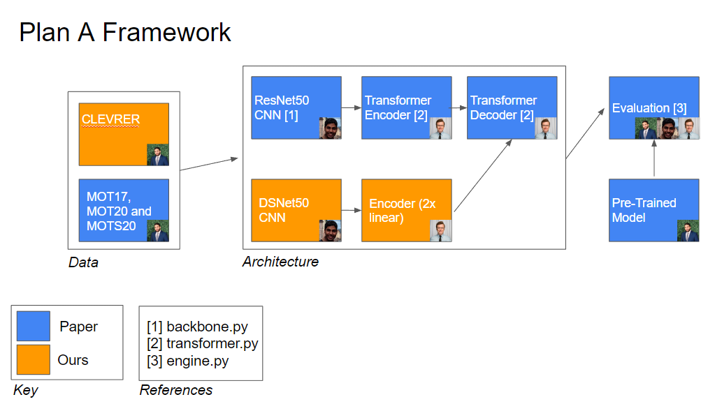
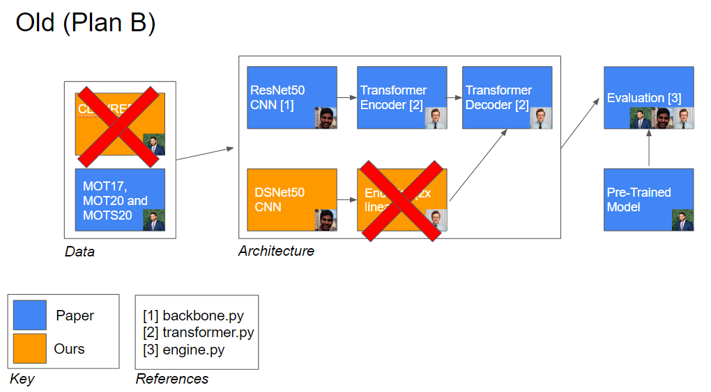
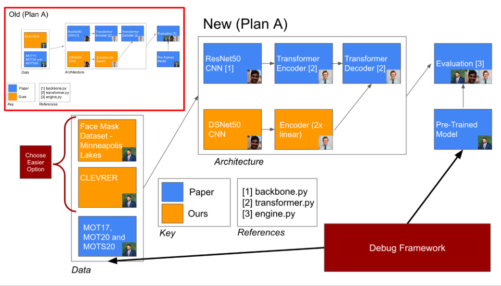
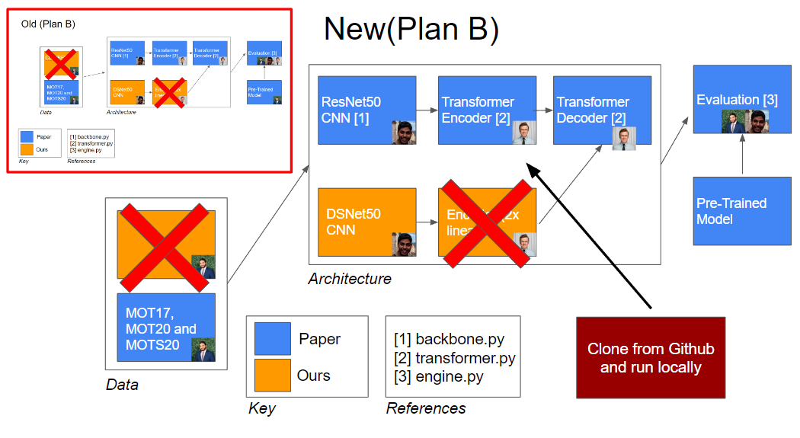

# DeepRob-Trackformer

## Reimplementation, Evaluation, and Fine-tuning of Trackformer on Novel Data 

### Final Project

### Based on the paper:
[TrackFormer: Multi-Object Tracking with Transformers](https://arxiv.org/abs/2101.02702) paper by [Tim Meinhardt](https://dvl.in.tum.de/team/meinhardt/), [Alexander Kirillov](https://alexander-kirillov.github.io/), [Laura Leal-Taixe](https://dvl.in.tum.de/team/lealtaixe/) and [Christoph Feichtenhofer](https://feichtenhofer.github.io/).

### Title Breakdown
Reimplementation - The main goal of our project was to reimplement the paper for testing and evaluation

Evaluation -Using the reimplemented trackformer we tested new data previously not tested using trackformer to explore the limitations of the technique

Fine-tuning - Improving the existing model to track more successfully on datasets outside of the original scope

Trackformer - New and Unique approach to Multi-Object tracking using transformers

### Inputs/Outputs
#### Inputs:
    New data previously not tested on trackformer.
        Videos with characteristics significantly different from MOT17 that was used to train model.
#### Outputs:
    Part 1 - Results from testing on novel data
    Part 2 - New model based on original trackformer model fine-tuned with new datasets (Not Completed)

### Original Plan A

### Original Plan B

### Updated Plan A

### Updated Plan B

<video src="docs/luffy_trackformer.mp4" controls title="Title"></video>

<video src="docs/mpls_lakes_3_trackformer.mp4" controls title="Title"></video>
